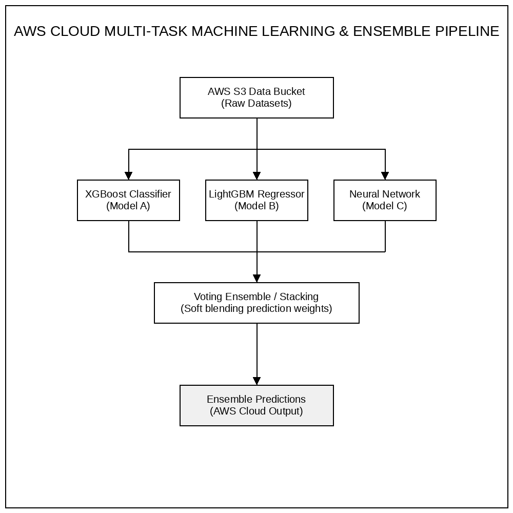
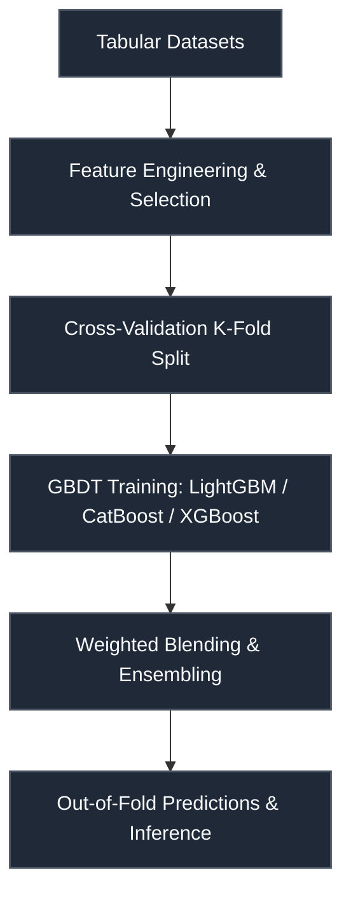

# Zelestra × AWS — ML Ascend Challenge

 

> **Host:** [`Zelestra & AWS`]  
> **Platform Link:** [Kaggle Competition](https://www.kaggle.com/competitions/zelestra-aws-ml-ascend-challenge)  
> **Dataset Link:** [Kaggle Dataset](https://www.kaggle.com/competitions/zelestra-aws-ml-ascend-challenge/data)  
> **Domain:** `Multi-Task ML & Cloud AI`

## Overview

This repository contains the developmental workspace and notebooks for the **Zelestra × AWS — ML Ascend Challenge** project. The primary focus of this project is in the domain of **Multi-Task ML & Cloud AI** on Zelestra & AWS. The codebase represents an iterative implementation of machine learning pipelines, structured to process datasets, train models, and validate predictions.

### Project Context

!pip install flaml[automl] matplotlib openml. !pip install autogluon.

### Technical Methodology & Implementation

The codebase features a total of 2395 cells across 166 notebook(s). The system implements several key architectural elements:
- **Core Classes**: Custom object-oriented structures are defined to manage state and logic, including: `DataPreprocessing`, `GCF`, `LSTMRegressor`, `Monitor`, `ZelestraData`, `model_infrence`.
- **Key Algorithms & Utilities**: Procedural helpers and utilities facilitate operations, notably: `__getitem__`, `__init__`, `__len__`, `__new__`, `_apply_feature_selection`, `_calculate_losses`, `_categorize_features`, `_convert_h2oframe_to_numeric`.
- **Training & Optimization**: Includes optimization via Adam, cross-validation strategy for stable predictions.

## System Architecture

## Notebook Architecture

### Preprocessing & EDA

| Notebook / Script | Type | Versions | Average Size | Core Stack / Techniques |
| :--- | :--- | :--- | :--- | :--- |
| **LightGBM_LightGBM_XGBoost_XGBoost_CatBoost_EDA_and_Visualization** | Multi-Version Script | [v1](./Preprocessing%20%26%20EDA/LightGBM_LightGBM_XGBoost_XGBoost_CatBoost_EDA_and_Visualization/v1.ipynb), [v2](./Preprocessing%20%26%20EDA/LightGBM_LightGBM_XGBoost_XGBoost_CatBoost_EDA_and_Visualization/v2.ipynb), [v3](./Preprocessing%20%26%20EDA/LightGBM_LightGBM_XGBoost_XGBoost_CatBoost_EDA_and_Visualization/v3.ipynb), [v4](./Preprocessing%20%26%20EDA/LightGBM_LightGBM_XGBoost_XGBoost_CatBoost_EDA_and_Visualization/v4.ipynb), [v5](./Preprocessing%20%26%20EDA/LightGBM_LightGBM_XGBoost_XGBoost_CatBoost_EDA_and_Visualization/v5.ipynb), [v6](./Preprocessing%20%26%20EDA/LightGBM_LightGBM_XGBoost_XGBoost_CatBoost_EDA_and_Visualization/v6.ipynb), [v7](./Preprocessing%20%26%20EDA/LightGBM_LightGBM_XGBoost_XGBoost_CatBoost_EDA_and_Visualization/v7.ipynb), [v8](./Preprocessing%20%26%20EDA/LightGBM_LightGBM_XGBoost_XGBoost_CatBoost_EDA_and_Visualization/v8.ipynb), [v9](./Preprocessing%20%26%20EDA/LightGBM_LightGBM_XGBoost_XGBoost_CatBoost_EDA_and_Visualization/v9.ipynb) | 864 KB | CatBoost, LightGBM, Scikit-Learn, XGBoost |
| **LightGBM_LightGBM_XGBoost_XGBoost_CatBoost_EDA_and_Visualization_2** | Multi-Version Script | [v1](./Preprocessing%20%26%20EDA/LightGBM_LightGBM_XGBoost_XGBoost_CatBoost_EDA_and_Visualization_2/v1.ipynb), [v2](./Preprocessing%20%26%20EDA/LightGBM_LightGBM_XGBoost_XGBoost_CatBoost_EDA_and_Visualization_2/v2.ipynb), [v3](./Preprocessing%20%26%20EDA/LightGBM_LightGBM_XGBoost_XGBoost_CatBoost_EDA_and_Visualization_2/v3.ipynb), [v4](./Preprocessing%20%26%20EDA/LightGBM_LightGBM_XGBoost_XGBoost_CatBoost_EDA_and_Visualization_2/v4.ipynb), [v5](./Preprocessing%20%26%20EDA/LightGBM_LightGBM_XGBoost_XGBoost_CatBoost_EDA_and_Visualization_2/v5.ipynb), [v6](./Preprocessing%20%26%20EDA/LightGBM_LightGBM_XGBoost_XGBoost_CatBoost_EDA_and_Visualization_2/v6.ipynb), [v7](./Preprocessing%20%26%20EDA/LightGBM_LightGBM_XGBoost_XGBoost_CatBoost_EDA_and_Visualization_2/v7.ipynb), [v8](./Preprocessing%20%26%20EDA/LightGBM_LightGBM_XGBoost_XGBoost_CatBoost_EDA_and_Visualization_2/v8.ipynb), [v9](./Preprocessing%20%26%20EDA/LightGBM_LightGBM_XGBoost_XGBoost_CatBoost_EDA_and_Visualization_2/v9.ipynb), [v10](./Preprocessing%20%26%20EDA/LightGBM_LightGBM_XGBoost_XGBoost_CatBoost_EDA_and_Visualization_2/v10.ipynb), [v11](./Preprocessing%20%26%20EDA/LightGBM_LightGBM_XGBoost_XGBoost_CatBoost_EDA_and_Visualization_2/v11.ipynb), [v12](./Preprocessing%20%26%20EDA/LightGBM_LightGBM_XGBoost_XGBoost_CatBoost_EDA_and_Visualization_2/v12.ipynb), [v13](./Preprocessing%20%26%20EDA/LightGBM_LightGBM_XGBoost_XGBoost_CatBoost_EDA_and_Visualization_2/v13.ipynb) | 322 KB | CatBoost, LightGBM, Scikit-Learn, XGBoost |

### Models & Utilities

| Notebook / Script | Type | Versions | Average Size | Core Stack / Techniques |
| :--- | :--- | :--- | :--- | :--- |
| [Utility](./Models%20%26%20Utilities/Utility.ipynb) | Single Notebook | v1 | 38 KB | Python |

### Training

| Notebook / Script | Type | Versions | Average Size | Core Stack / Techniques |
| :--- | :--- | :--- | :--- | :--- |
| [LSTM_Training](./Training/LSTM_Training.ipynb) | Single Notebook | v1 | 62 KB | PyTorch, Scikit-Learn |
| **LightGBM_LightGBM_XGBoost_XGBoost_CatBoost_SVM_DecisionTree_Training** | Multi-Version Script | [v1](./Training/LightGBM_LightGBM_XGBoost_XGBoost_CatBoost_SVM_DecisionTree_Training/v1.ipynb), [v2](./Training/LightGBM_LightGBM_XGBoost_XGBoost_CatBoost_SVM_DecisionTree_Training/v2.ipynb), [v3](./Training/LightGBM_LightGBM_XGBoost_XGBoost_CatBoost_SVM_DecisionTree_Training/v3.ipynb), [v4](./Training/LightGBM_LightGBM_XGBoost_XGBoost_CatBoost_SVM_DecisionTree_Training/v4.ipynb), [v5](./Training/LightGBM_LightGBM_XGBoost_XGBoost_CatBoost_SVM_DecisionTree_Training/v5.ipynb), [v6](./Training/LightGBM_LightGBM_XGBoost_XGBoost_CatBoost_SVM_DecisionTree_Training/v6.ipynb), [v7](./Training/LightGBM_LightGBM_XGBoost_XGBoost_CatBoost_SVM_DecisionTree_Training/v7.ipynb), [v8](./Training/LightGBM_LightGBM_XGBoost_XGBoost_CatBoost_SVM_DecisionTree_Training/v8.ipynb), [v9](./Training/LightGBM_LightGBM_XGBoost_XGBoost_CatBoost_SVM_DecisionTree_Training/v9.ipynb), [v10](./Training/LightGBM_LightGBM_XGBoost_XGBoost_CatBoost_SVM_DecisionTree_Training/v10.ipynb), [v11](./Training/LightGBM_LightGBM_XGBoost_XGBoost_CatBoost_SVM_DecisionTree_Training/v11.ipynb), [v12](./Training/LightGBM_LightGBM_XGBoost_XGBoost_CatBoost_SVM_DecisionTree_Training/v12.ipynb), [v13](./Training/LightGBM_LightGBM_XGBoost_XGBoost_CatBoost_SVM_DecisionTree_Training/v13.ipynb), [v14](./Training/LightGBM_LightGBM_XGBoost_XGBoost_CatBoost_SVM_DecisionTree_Training/v14.ipynb), [v15](./Training/LightGBM_LightGBM_XGBoost_XGBoost_CatBoost_SVM_DecisionTree_Training/v15.ipynb), [v16](./Training/LightGBM_LightGBM_XGBoost_XGBoost_CatBoost_SVM_DecisionTree_Training/v16.ipynb), [v17](./Training/LightGBM_LightGBM_XGBoost_XGBoost_CatBoost_SVM_DecisionTree_Training/v17.ipynb), [v18](./Training/LightGBM_LightGBM_XGBoost_XGBoost_CatBoost_SVM_DecisionTree_Training/v18.ipynb), [v19](./Training/LightGBM_LightGBM_XGBoost_XGBoost_CatBoost_SVM_DecisionTree_Training/v19.ipynb), [v20](./Training/LightGBM_LightGBM_XGBoost_XGBoost_CatBoost_SVM_DecisionTree_Training/v20.ipynb), [v21](./Training/LightGBM_LightGBM_XGBoost_XGBoost_CatBoost_SVM_DecisionTree_Training/v21.ipynb), [v22](./Training/LightGBM_LightGBM_XGBoost_XGBoost_CatBoost_SVM_DecisionTree_Training/v22.ipynb), [v23](./Training/LightGBM_LightGBM_XGBoost_XGBoost_CatBoost_SVM_DecisionTree_Training/v23.ipynb), [v24](./Training/LightGBM_LightGBM_XGBoost_XGBoost_CatBoost_SVM_DecisionTree_Training/v24.ipynb), [v25](./Training/LightGBM_LightGBM_XGBoost_XGBoost_CatBoost_SVM_DecisionTree_Training/v25.ipynb), [v26](./Training/LightGBM_LightGBM_XGBoost_XGBoost_CatBoost_SVM_DecisionTree_Training/v26.ipynb), [v27](./Training/LightGBM_LightGBM_XGBoost_XGBoost_CatBoost_SVM_DecisionTree_Training/v27.ipynb), [v28](./Training/LightGBM_LightGBM_XGBoost_XGBoost_CatBoost_SVM_DecisionTree_Training/v28.ipynb), [v29](./Training/LightGBM_LightGBM_XGBoost_XGBoost_CatBoost_SVM_DecisionTree_Training/v29.ipynb), [v30](./Training/LightGBM_LightGBM_XGBoost_XGBoost_CatBoost_SVM_DecisionTree_Training/v30.ipynb), [v31](./Training/LightGBM_LightGBM_XGBoost_XGBoost_CatBoost_SVM_DecisionTree_Training/v31.ipynb), [v32](./Training/LightGBM_LightGBM_XGBoost_XGBoost_CatBoost_SVM_DecisionTree_Training/v32.ipynb), [v33](./Training/LightGBM_LightGBM_XGBoost_XGBoost_CatBoost_SVM_DecisionTree_Training/v33.ipynb), [v34](./Training/LightGBM_LightGBM_XGBoost_XGBoost_CatBoost_SVM_DecisionTree_Training/v34.ipynb), [v35](./Training/LightGBM_LightGBM_XGBoost_XGBoost_CatBoost_SVM_DecisionTree_Training/v35.ipynb), [v36](./Training/LightGBM_LightGBM_XGBoost_XGBoost_CatBoost_SVM_DecisionTree_Training/v36.ipynb), [v37](./Training/LightGBM_LightGBM_XGBoost_XGBoost_CatBoost_SVM_DecisionTree_Training/v37.ipynb), [v38](./Training/LightGBM_LightGBM_XGBoost_XGBoost_CatBoost_SVM_DecisionTree_Training/v38.ipynb), [v39](./Training/LightGBM_LightGBM_XGBoost_XGBoost_CatBoost_SVM_DecisionTree_Training/v39.ipynb), [v40](./Training/LightGBM_LightGBM_XGBoost_XGBoost_CatBoost_SVM_DecisionTree_Training/v40.ipynb) | 53 KB | CatBoost, LightGBM, Requests API, Scikit-Learn, XGBoost |
| **LightGBM_LightGBM_XGBoost_XGBoost_CatBoost_SVM_DecisionTree_Training_2** | Multi-Version Script | [v1](./Training/LightGBM_LightGBM_XGBoost_XGBoost_CatBoost_SVM_DecisionTree_Training_2/v1.ipynb), [v2](./Training/LightGBM_LightGBM_XGBoost_XGBoost_CatBoost_SVM_DecisionTree_Training_2/v2.ipynb), [v3](./Training/LightGBM_LightGBM_XGBoost_XGBoost_CatBoost_SVM_DecisionTree_Training_2/v3.ipynb), [v4](./Training/LightGBM_LightGBM_XGBoost_XGBoost_CatBoost_SVM_DecisionTree_Training_2/v4.ipynb) | 10 KB | CatBoost, LightGBM, Requests API, Scikit-Learn, XGBoost |

### Inference & Submission

| Notebook / Script | Type | Versions | Average Size | Core Stack / Techniques |
| :--- | :--- | :--- | :--- | :--- |
| **LightGBM_LightGBM_XGBoost_XGBoost_CatBoost_SVM_DecisionTree_Inference** | Multi-Version Script | [v19](./Inference%20%26%20Submission/LightGBM_LightGBM_XGBoost_XGBoost_CatBoost_SVM_DecisionTree_Inference/v19.ipynb), [v20](./Inference%20%26%20Submission/LightGBM_LightGBM_XGBoost_XGBoost_CatBoost_SVM_DecisionTree_Inference/v20.ipynb), [v21](./Inference%20%26%20Submission/LightGBM_LightGBM_XGBoost_XGBoost_CatBoost_SVM_DecisionTree_Inference/v21.ipynb), [v22](./Inference%20%26%20Submission/LightGBM_LightGBM_XGBoost_XGBoost_CatBoost_SVM_DecisionTree_Inference/v22.ipynb), [v23](./Inference%20%26%20Submission/LightGBM_LightGBM_XGBoost_XGBoost_CatBoost_SVM_DecisionTree_Inference/v23.ipynb), [v24](./Inference%20%26%20Submission/LightGBM_LightGBM_XGBoost_XGBoost_CatBoost_SVM_DecisionTree_Inference/v24.ipynb), [v25](./Inference%20%26%20Submission/LightGBM_LightGBM_XGBoost_XGBoost_CatBoost_SVM_DecisionTree_Inference/v25.ipynb), [v26](./Inference%20%26%20Submission/LightGBM_LightGBM_XGBoost_XGBoost_CatBoost_SVM_DecisionTree_Inference/v26.ipynb), [v27](./Inference%20%26%20Submission/LightGBM_LightGBM_XGBoost_XGBoost_CatBoost_SVM_DecisionTree_Inference/v27.ipynb), [v28](./Inference%20%26%20Submission/LightGBM_LightGBM_XGBoost_XGBoost_CatBoost_SVM_DecisionTree_Inference/v28.ipynb), [v29](./Inference%20%26%20Submission/LightGBM_LightGBM_XGBoost_XGBoost_CatBoost_SVM_DecisionTree_Inference/v29.ipynb), [v30](./Inference%20%26%20Submission/LightGBM_LightGBM_XGBoost_XGBoost_CatBoost_SVM_DecisionTree_Inference/v30.ipynb), [v31](./Inference%20%26%20Submission/LightGBM_LightGBM_XGBoost_XGBoost_CatBoost_SVM_DecisionTree_Inference/v31.ipynb), [v32](./Inference%20%26%20Submission/LightGBM_LightGBM_XGBoost_XGBoost_CatBoost_SVM_DecisionTree_Inference/v32.ipynb), [v33](./Inference%20%26%20Submission/LightGBM_LightGBM_XGBoost_XGBoost_CatBoost_SVM_DecisionTree_Inference/v33.ipynb), [v34](./Inference%20%26%20Submission/LightGBM_LightGBM_XGBoost_XGBoost_CatBoost_SVM_DecisionTree_Inference/v34.ipynb), [v35](./Inference%20%26%20Submission/LightGBM_LightGBM_XGBoost_XGBoost_CatBoost_SVM_DecisionTree_Inference/v35.ipynb), [v36](./Inference%20%26%20Submission/LightGBM_LightGBM_XGBoost_XGBoost_CatBoost_SVM_DecisionTree_Inference/v36.ipynb), [v37](./Inference%20%26%20Submission/LightGBM_LightGBM_XGBoost_XGBoost_CatBoost_SVM_DecisionTree_Inference/v37.ipynb), [v38](./Inference%20%26%20Submission/LightGBM_LightGBM_XGBoost_XGBoost_CatBoost_SVM_DecisionTree_Inference/v38.ipynb), [v39](./Inference%20%26%20Submission/LightGBM_LightGBM_XGBoost_XGBoost_CatBoost_SVM_DecisionTree_Inference/v39.ipynb), [v40](./Inference%20%26%20Submission/LightGBM_LightGBM_XGBoost_XGBoost_CatBoost_SVM_DecisionTree_Inference/v40.ipynb), [v41](./Inference%20%26%20Submission/LightGBM_LightGBM_XGBoost_XGBoost_CatBoost_SVM_DecisionTree_Inference/v41.ipynb), [v42](./Inference%20%26%20Submission/LightGBM_LightGBM_XGBoost_XGBoost_CatBoost_SVM_DecisionTree_Inference/v42.ipynb), [v43](./Inference%20%26%20Submission/LightGBM_LightGBM_XGBoost_XGBoost_CatBoost_SVM_DecisionTree_Inference/v43.ipynb), [v44](./Inference%20%26%20Submission/LightGBM_LightGBM_XGBoost_XGBoost_CatBoost_SVM_DecisionTree_Inference/v44.ipynb), [v45](./Inference%20%26%20Submission/LightGBM_LightGBM_XGBoost_XGBoost_CatBoost_SVM_DecisionTree_Inference/v45.ipynb), [v46](./Inference%20%26%20Submission/LightGBM_LightGBM_XGBoost_XGBoost_CatBoost_SVM_DecisionTree_Inference/v46.ipynb), [v47](./Inference%20%26%20Submission/LightGBM_LightGBM_XGBoost_XGBoost_CatBoost_SVM_DecisionTree_Inference/v47.ipynb), [v48](./Inference%20%26%20Submission/LightGBM_LightGBM_XGBoost_XGBoost_CatBoost_SVM_DecisionTree_Inference/v48.ipynb), [v49](./Inference%20%26%20Submission/LightGBM_LightGBM_XGBoost_XGBoost_CatBoost_SVM_DecisionTree_Inference/v49.ipynb), [v50](./Inference%20%26%20Submission/LightGBM_LightGBM_XGBoost_XGBoost_CatBoost_SVM_DecisionTree_Inference/v50.ipynb), [v51](./Inference%20%26%20Submission/LightGBM_LightGBM_XGBoost_XGBoost_CatBoost_SVM_DecisionTree_Inference/v51.ipynb), [v52](./Inference%20%26%20Submission/LightGBM_LightGBM_XGBoost_XGBoost_CatBoost_SVM_DecisionTree_Inference/v52.ipynb), [v53](./Inference%20%26%20Submission/LightGBM_LightGBM_XGBoost_XGBoost_CatBoost_SVM_DecisionTree_Inference/v53.ipynb), [v54](./Inference%20%26%20Submission/LightGBM_LightGBM_XGBoost_XGBoost_CatBoost_SVM_DecisionTree_Inference/v54.ipynb), [v55](./Inference%20%26%20Submission/LightGBM_LightGBM_XGBoost_XGBoost_CatBoost_SVM_DecisionTree_Inference/v55.ipynb), [v56](./Inference%20%26%20Submission/LightGBM_LightGBM_XGBoost_XGBoost_CatBoost_SVM_DecisionTree_Inference/v56.ipynb), [v57](./Inference%20%26%20Submission/LightGBM_LightGBM_XGBoost_XGBoost_CatBoost_SVM_DecisionTree_Inference/v57.ipynb), [v58](./Inference%20%26%20Submission/LightGBM_LightGBM_XGBoost_XGBoost_CatBoost_SVM_DecisionTree_Inference/v58.ipynb), [v59](./Inference%20%26%20Submission/LightGBM_LightGBM_XGBoost_XGBoost_CatBoost_SVM_DecisionTree_Inference/v59.ipynb), [v60](./Inference%20%26%20Submission/LightGBM_LightGBM_XGBoost_XGBoost_CatBoost_SVM_DecisionTree_Inference/v60.ipynb), [v61](./Inference%20%26%20Submission/LightGBM_LightGBM_XGBoost_XGBoost_CatBoost_SVM_DecisionTree_Inference/v61.ipynb), [v62](./Inference%20%26%20Submission/LightGBM_LightGBM_XGBoost_XGBoost_CatBoost_SVM_DecisionTree_Inference/v62.ipynb), [v63](./Inference%20%26%20Submission/LightGBM_LightGBM_XGBoost_XGBoost_CatBoost_SVM_DecisionTree_Inference/v63.ipynb), [v64](./Inference%20%26%20Submission/LightGBM_LightGBM_XGBoost_XGBoost_CatBoost_SVM_DecisionTree_Inference/v64.ipynb), [v65](./Inference%20%26%20Submission/LightGBM_LightGBM_XGBoost_XGBoost_CatBoost_SVM_DecisionTree_Inference/v65.ipynb), [v66](./Inference%20%26%20Submission/LightGBM_LightGBM_XGBoost_XGBoost_CatBoost_SVM_DecisionTree_Inference/v66.ipynb), [v67](./Inference%20%26%20Submission/LightGBM_LightGBM_XGBoost_XGBoost_CatBoost_SVM_DecisionTree_Inference/v67.ipynb), [v68](./Inference%20%26%20Submission/LightGBM_LightGBM_XGBoost_XGBoost_CatBoost_SVM_DecisionTree_Inference/v68.ipynb), [v69](./Inference%20%26%20Submission/LightGBM_LightGBM_XGBoost_XGBoost_CatBoost_SVM_DecisionTree_Inference/v69.ipynb), [v70](./Inference%20%26%20Submission/LightGBM_LightGBM_XGBoost_XGBoost_CatBoost_SVM_DecisionTree_Inference/v70.ipynb), [v71](./Inference%20%26%20Submission/LightGBM_LightGBM_XGBoost_XGBoost_CatBoost_SVM_DecisionTree_Inference/v71.ipynb), [v72](./Inference%20%26%20Submission/LightGBM_LightGBM_XGBoost_XGBoost_CatBoost_SVM_DecisionTree_Inference/v72.ipynb), [v73](./Inference%20%26%20Submission/LightGBM_LightGBM_XGBoost_XGBoost_CatBoost_SVM_DecisionTree_Inference/v73.ipynb), [v74](./Inference%20%26%20Submission/LightGBM_LightGBM_XGBoost_XGBoost_CatBoost_SVM_DecisionTree_Inference/v74.ipynb), [v75](./Inference%20%26%20Submission/LightGBM_LightGBM_XGBoost_XGBoost_CatBoost_SVM_DecisionTree_Inference/v75.ipynb), [v76](./Inference%20%26%20Submission/LightGBM_LightGBM_XGBoost_XGBoost_CatBoost_SVM_DecisionTree_Inference/v76.ipynb), [v77](./Inference%20%26%20Submission/LightGBM_LightGBM_XGBoost_XGBoost_CatBoost_SVM_DecisionTree_Inference/v77.ipynb), [v78](./Inference%20%26%20Submission/LightGBM_LightGBM_XGBoost_XGBoost_CatBoost_SVM_DecisionTree_Inference/v78.ipynb), [v79](./Inference%20%26%20Submission/LightGBM_LightGBM_XGBoost_XGBoost_CatBoost_SVM_DecisionTree_Inference/v79.ipynb), [v80](./Inference%20%26%20Submission/LightGBM_LightGBM_XGBoost_XGBoost_CatBoost_SVM_DecisionTree_Inference/v80.ipynb), [v81](./Inference%20%26%20Submission/LightGBM_LightGBM_XGBoost_XGBoost_CatBoost_SVM_DecisionTree_Inference/v81.ipynb), [v82](./Inference%20%26%20Submission/LightGBM_LightGBM_XGBoost_XGBoost_CatBoost_SVM_DecisionTree_Inference/v82.ipynb), [v83](./Inference%20%26%20Submission/LightGBM_LightGBM_XGBoost_XGBoost_CatBoost_SVM_DecisionTree_Inference/v83.ipynb), [v84](./Inference%20%26%20Submission/LightGBM_LightGBM_XGBoost_XGBoost_CatBoost_SVM_DecisionTree_Inference/v84.ipynb), [v85](./Inference%20%26%20Submission/LightGBM_LightGBM_XGBoost_XGBoost_CatBoost_SVM_DecisionTree_Inference/v85.ipynb), [v86](./Inference%20%26%20Submission/LightGBM_LightGBM_XGBoost_XGBoost_CatBoost_SVM_DecisionTree_Inference/v86.ipynb), [v87](./Inference%20%26%20Submission/LightGBM_LightGBM_XGBoost_XGBoost_CatBoost_SVM_DecisionTree_Inference/v87.ipynb), [v88](./Inference%20%26%20Submission/LightGBM_LightGBM_XGBoost_XGBoost_CatBoost_SVM_DecisionTree_Inference/v88.ipynb), [v89](./Inference%20%26%20Submission/LightGBM_LightGBM_XGBoost_XGBoost_CatBoost_SVM_DecisionTree_Inference/v89.ipynb), [v90](./Inference%20%26%20Submission/LightGBM_LightGBM_XGBoost_XGBoost_CatBoost_SVM_DecisionTree_Inference/v90.ipynb), [v91](./Inference%20%26%20Submission/LightGBM_LightGBM_XGBoost_XGBoost_CatBoost_SVM_DecisionTree_Inference/v91.ipynb), [v92](./Inference%20%26%20Submission/LightGBM_LightGBM_XGBoost_XGBoost_CatBoost_SVM_DecisionTree_Inference/v92.ipynb), [v93](./Inference%20%26%20Submission/LightGBM_LightGBM_XGBoost_XGBoost_CatBoost_SVM_DecisionTree_Inference/v93.ipynb), [v94](./Inference%20%26%20Submission/LightGBM_LightGBM_XGBoost_XGBoost_CatBoost_SVM_DecisionTree_Inference/v94.ipynb), [v95](./Inference%20%26%20Submission/LightGBM_LightGBM_XGBoost_XGBoost_CatBoost_SVM_DecisionTree_Inference/v95.ipynb), [v96](./Inference%20%26%20Submission/LightGBM_LightGBM_XGBoost_XGBoost_CatBoost_SVM_DecisionTree_Inference/v96.ipynb), [v97](./Inference%20%26%20Submission/LightGBM_LightGBM_XGBoost_XGBoost_CatBoost_SVM_DecisionTree_Inference/v97.ipynb), [v98](./Inference%20%26%20Submission/LightGBM_LightGBM_XGBoost_XGBoost_CatBoost_SVM_DecisionTree_Inference/v98.ipynb), [v99](./Inference%20%26%20Submission/LightGBM_LightGBM_XGBoost_XGBoost_CatBoost_SVM_DecisionTree_Inference/v99.ipynb), [v100](./Inference%20%26%20Submission/LightGBM_LightGBM_XGBoost_XGBoost_CatBoost_SVM_DecisionTree_Inference/v100.ipynb), [v101](./Inference%20%26%20Submission/LightGBM_LightGBM_XGBoost_XGBoost_CatBoost_SVM_DecisionTree_Inference/v101.ipynb), [v102](./Inference%20%26%20Submission/LightGBM_LightGBM_XGBoost_XGBoost_CatBoost_SVM_DecisionTree_Inference/v102.ipynb), [v103](./Inference%20%26%20Submission/LightGBM_LightGBM_XGBoost_XGBoost_CatBoost_SVM_DecisionTree_Inference/v103.ipynb), [v104](./Inference%20%26%20Submission/LightGBM_LightGBM_XGBoost_XGBoost_CatBoost_SVM_DecisionTree_Inference/v104.ipynb), [v105](./Inference%20%26%20Submission/LightGBM_LightGBM_XGBoost_XGBoost_CatBoost_SVM_DecisionTree_Inference/v105.ipynb), [v106](./Inference%20%26%20Submission/LightGBM_LightGBM_XGBoost_XGBoost_CatBoost_SVM_DecisionTree_Inference/v106.ipynb), [v107](./Inference%20%26%20Submission/LightGBM_LightGBM_XGBoost_XGBoost_CatBoost_SVM_DecisionTree_Inference/v107.ipynb), [v108](./Inference%20%26%20Submission/LightGBM_LightGBM_XGBoost_XGBoost_CatBoost_SVM_DecisionTree_Inference/v108.ipynb), [v109](./Inference%20%26%20Submission/LightGBM_LightGBM_XGBoost_XGBoost_CatBoost_SVM_DecisionTree_Inference/v109.ipynb), [v110](./Inference%20%26%20Submission/LightGBM_LightGBM_XGBoost_XGBoost_CatBoost_SVM_DecisionTree_Inference/v110.ipynb), [v111](./Inference%20%26%20Submission/LightGBM_LightGBM_XGBoost_XGBoost_CatBoost_SVM_DecisionTree_Inference/v111.ipynb) | 44 KB | CatBoost, CoxPH Survival Analysis, LightGBM, PyTorch, Requests API, Scikit-Learn, XGBoost |
| **LightGBM_LightGBM_XGBoost_XGBoost_CatBoost_SVM_Inference** | Multi-Version Script | [v1](./Inference%20%26%20Submission/LightGBM_LightGBM_XGBoost_XGBoost_CatBoost_SVM_Inference/v1.ipynb), [v2](./Inference%20%26%20Submission/LightGBM_LightGBM_XGBoost_XGBoost_CatBoost_SVM_Inference/v2.ipynb), [v3](./Inference%20%26%20Submission/LightGBM_LightGBM_XGBoost_XGBoost_CatBoost_SVM_Inference/v3.ipynb), [v4](./Inference%20%26%20Submission/LightGBM_LightGBM_XGBoost_XGBoost_CatBoost_SVM_Inference/v4.ipynb), [v5](./Inference%20%26%20Submission/LightGBM_LightGBM_XGBoost_XGBoost_CatBoost_SVM_Inference/v5.ipynb) | 141 KB | CatBoost, CoxPH Survival Analysis, LightGBM, Requests API, Scikit-Learn, XGBoost |

## Navigation Guidelines

> **Stage Guidelines**
>
- **EDA & Preprocessing**: Verify data loaders and inspect class distributions before model design.
- **Training & Validation**: Check training runs, loss curves, and model validation scores to evaluate performance.
- **Inference & Ensembling**: Run predictions on testing files and verify submission formatting.

---

> "We upload our models to the cloud, hoping the servers never go dark."
>
> — **Vigneshwaran S**
